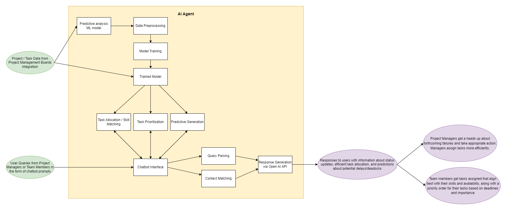

## Design D0 (High-Level Overview) 

This diagram provides a basic overview of how the system operates at a high level:
- **Inputs:** 
   - Project/Task Data: Information related to tasks, deadlines, team member availability, etc.
   - User Queries: Requests from users (managers or team members) asking for project insights.
- **AI Agent:** Acts as the core of the system, processing these inputs.
- **Output:** 
   - The AI Agent responds to user queries with information such as task assignments, project status, or predictive insights on potential delays.

## Design D1 (Subsystem Breakdown) 

This diagram expands upon the AI agent and divides it into core subsystems that handle specific operations:
- **Inputs:** 
   - Project/Task Data from project management boards and user queries.
- **Subsystems:**
   - **Trained Model:** Processes project data for task allocation, predictions, etc.
   - **Chatbot Interface:** Handles user interactions and translates queries.
   - **Predictive Analysis/ML Model:** Provides predictions and insights based on project data and queries asked.
- **Output:** 
   - Responses are generated for users, including status updates, task assignments, and potential risk forecasts.

## Design D2 (Detailed Functional Breakdown) 

This is a more detailed version of Design D1, breaking down each component further:
- **Inputs:** 
   - Project/Task Data and user queries as before.
- **Subsystems:** 
   - **Predictive Analysis ML Model:** Handles data preprocessing, model training, and prediction generation.
   - **Trained Model:** Focuses on skill matching, task prioritization, predictions. Interacts with the chatbot interface. 
   - **Chatbot Interface:** Broken down into subcomponents such as query parsing, context matching, and response generation.
- **Output:**
   - The AI provides real-time responses to users, delivering status updates, task assignments based on skills, and predictive insights about potential risks.
   - Responses help managers and team members optimize task management and avoid delays.

Each diagram progressively elaborates on the system, with D2 providing a comprehensive look at the interaction between subsystems for task allocation, predictive analysis, and natural language processing.
